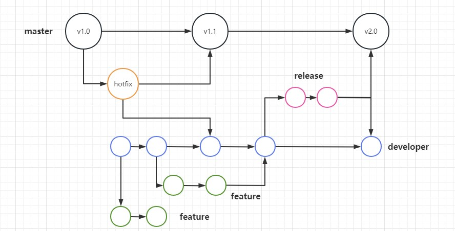
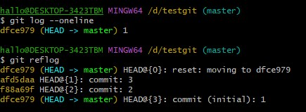
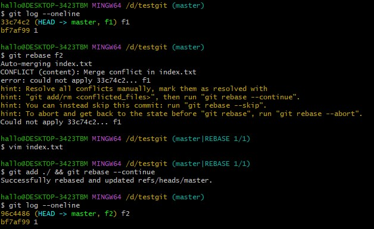
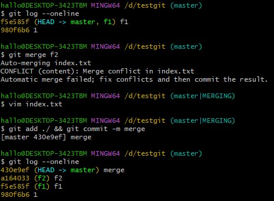
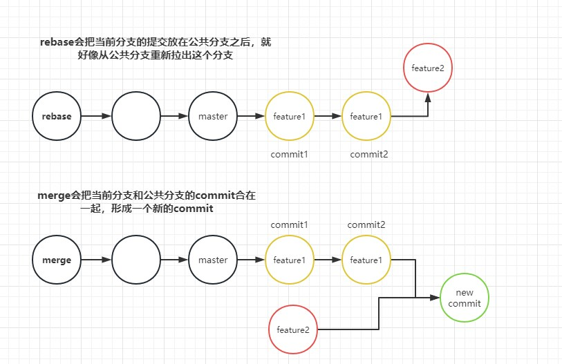

## GitFlow 协同工作流

### 1 常见协同工作流

#### 1.1 中心式协同工作流
拉、提、推 三步走
* git pull origin master
* git add . && git commit -m update
* git push origin master

只适合两个人左右的协同
#### 1.2 功能分支协同工作流
1. 根据功能创建新的功能分支 git checkout -b new-feature
2. 所有参与该功能开发的同学就在此分支上进行add、commit操作
3. git pull --rebase来拿到最新代码
4. 最后通过pull request方式进行code review之后合并到master

这种方式其实也是中心化开发，只不过是以服务器为中心，使用不同分支来完成对代码的隔离

但是我们的实际需求是，在不停开发过程中，要维护线上的代码稳定，仅靠一个master分支肯定是不够的，那么我们就需要：
1. 一个分支是绝对干净的，是随时能发布到生产环境的
2. 对于已经发布的代码要bugFix的时候，不会将正在开发中的代码更到线上环境

#### 1.3 GitFlow 协同工作流
1. master分支 （主干分支）
用于线上环境，绝对“干净”，每一次提交都可发布
2. feature分支 （功能分支）
用于开发功能
3. developer分支 （开发分支）
功能开发完成，就向developer分支合并，完成后删除功能分支
4. release分支 （预发布分支）
当developer分支测试达到可发布状态时，切出一个新release分支，目的是可以使developer分支继续向前，当release分支达到可上线状态时，将release分支同步向master和developer合并，以保证代码的一致性，然后将release分支删除
5. hotfix分支 （bugfix分支）
用于处理线上Bug，每次线上的Bugfix都需要开一个新分支，完成后同步向master、developer分支合并，之后删除该分支

诟病：层级太多，分支交叉太多 导致log很难看（参考 --no-ff）
#### 1.4 GitHub 协同工作流
也叫forking flow
1. 把官方库fork到自己代码库
2. 在自己的代码库开发
3. 向官方库发起pull request，code review通过之后，向官方库合并
#### 1.5 协同工作流的本质
1. 并行开发
2. 代码的一致性
3. 线上代码绝对稳定，绝对干净

**合适的就是最好的**
### 2 常用命令

#### 2.1 git log || git reflog

* **git log**
可以查看
 **当前分支**所有提交过的版本信息，
 **不包括**
已经被删除的commit记录和reset操作

* **git reflog**
可以查看
  **所有分支**所有操作记录，
  **包括**
已经被删除的commit记录和reset操作

**最大区别：**
能不能查询到被删除的commit记录和reset操作，reflog git后悔药

#### 2.2 git rebase || git merge

merge 解决完冲突会产生一个新的commit，rebase 不会产生额外的commit。 

rebase相对来说“更干净”，分支上不会有无意义的提交。 
如果合并的分支中存在多个commit，那么rebase的时候会对每一次commit进行合并，就需要重复处理多次冲突